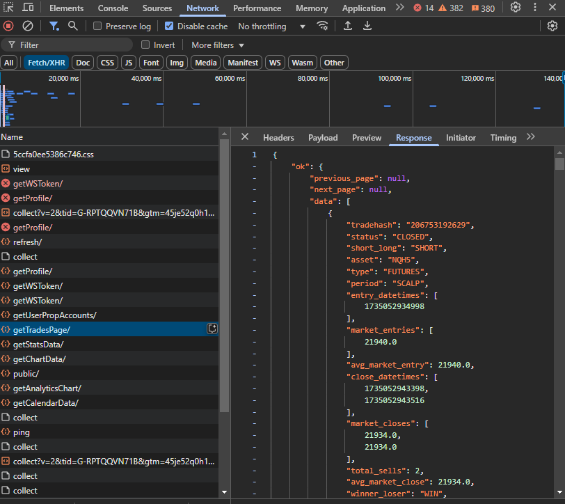
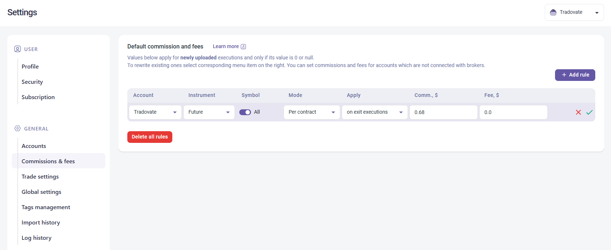

# MFF JSON to Tradovate CSV Converter

## Overview
This tool converts MyFundedFutures (MFF) JSON data (captured from the network tab) into a Tradovate-formatted CSV for seamless TradeZella import.

## Usage

### 1. Obtain MFF Trade Data
- Capture the **"getTradesPage"** POST request JSON data from the browser's developer tools (network tab).

**Example:**


### 2. Prepare the Input File
- Create a `.json` file in the **`input`** directory of the repository.
- Paste the copied JSON data into the file and save it.

### 3. Configure File Names
- Open **`consts/index.js`**.
- Set the correct **input** and **output** file names.

### 4. Run the Conversion
- Execute the command:
  ```sh
  npm start
  ```

### 5. Retrieve the Output File
- The converted CSV will be available in the **`output`** directory.

### 6. Import into TradeZella
- Select Tradovate as the broker.
- Upload the generated CSV file to TradeZella for analysis.


## Notes
You must update commissions and fees to accurately reflect your Net P&L.

